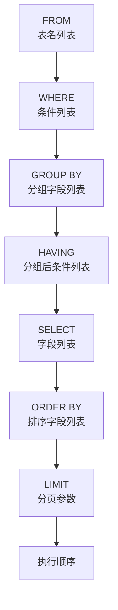
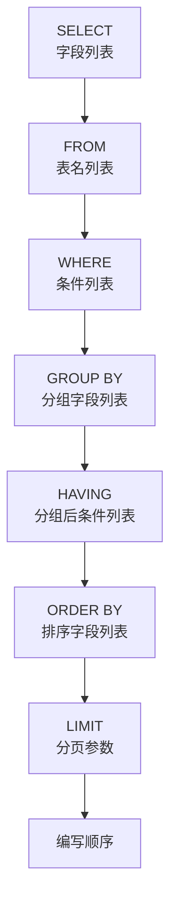

--- 
    layout: post 
    title: "MYSQL语法" 
    date: 2025-10-29 9:00:00 +0800 
    categories: 技术 MYSQL
    tags: [Structured Query Language, learning] 
    author: Kali-Defender 
---
SQL（Structured Query Language）结构化查询语言，主要分为四大类别：**DDL（数据定义语言）**、**DML（数据操作语言）**、**DQL（数据查询语言）** 和 **DCL（数据控制语言）**。以下为整合后的完整笔记，保留原始内容与逻辑结构。

---

## 一、数据定义语言 DDL（Data Definition Language）

**用途**：用来定义数据库对象（数据库、表、字段）。

### 1、数据库操作

#### 查询所有数据库
```sql
SHOW DATABASES;
```

#### 查询当前数据库
```sql
SELECT DATABASE();
```

#### 创建数据库
```sql
CREATE DATABASE [ IF NOT EXISTS ] 数据库名 [ DEFAULT CHARSET 字符集 ] [ COLLATE 排序规则 ];
```
> **说明**：在同一个数据库服务器中，不能创建两个名称相同的数据库，否则将会报错。使用 `IF NOT EXISTS` 可避免重复创建。
>
> **示例**：
> ```sql
> CREATE DATABASE IF NOT EXISTS itcast;
> ```

#### 删除数据库
```sql
DROP DATABASE [ IF EXISTS ] 数据库名;
```

#### 切换数据库
```sql
USE 数据库名;
```

---

### 2、表操作

#### A、查询与创建

##### 查询当前数据库所有表
```sql
SHOW TABLES;
```

##### 查看指定表结构
```sql
DESC 表名;
```

##### 查询指定表的建表语句
```sql
SHOW CREATE TABLE 表名;
```

##### 创建表结构
```sql
CREATE TABLE 表名(
    字段1 字段1类型 [ COMMENT 字段1注释 ],
    字段2 字段2类型 [ COMMENT 字段2注释 ],
    字段3 字段3类型 [ COMMENT 字段3注释 ],
    ...
    字段n 字段n类型 [ COMMENT 字段n注释 ]
) [ COMMENT 表注释 ];
```

---

#### B、数据类型

##### 1、数值型

| 类型       | 大小        | 有符号（SIGNED）范围               | 无符号（UNSIGNED）范围             | 描述             |
|------------|-------------|-------------------------------------|-------------------------------------|------------------|
| TINYINT    | 1 byte      | (-128, 127)                         | (0, 255)                            | 小整数值         |
| SMALLINT   | 2 bytes     | (-32768, 32767)                     | (0, 65535)                          | 大整数值         |
| MEDIUMINT  | 3 bytes     | (-8388608, 8388607)                 | (0, 16777215)                       | 大整数值         |
| INT/INTEGER| 4 bytes     | (-2147483648, 2147483647)           | (0, 4294967295)                     | 大整数值         |
| BIGINT     | 8 bytes     | (-2^63, 2^63-1)                     | (0, 2^64-1)                         | 极大整数值       |
| FLOAT      | 4 bytes     | (-3.402823466 E+38, 3.402823466 E+38)| 0 和 (1.175494351 E-38, 3.402823466 E+38) | 单精度浮点数值 |
| DOUBLE     | 8 bytes     | (-1.7976931348623157 E+308, 1.7976931348623157 E+308) | 0 和 (2.2250738585072014 E-308, 1.7976931348623157 E+308) | 双精度浮点数值 |
| DECIMAL    | 依赖于M和D  | 依赖于M（精度）和D（标度）的值      | 依赖于M（精度）和D（标度）的值      | 小数值（精确定点数） |

---

##### 2、字符串类型

| 类型       | 大小                  | 描述                         |
|------------|------------------------|------------------------------|
| CHAR       | 0-255 bytes           | 定长字符串（需指定长度）     |
| VARCHAR    | 0-65535 bytes         | 变长字符串（需指定长度）     |
| TINYBLOB   | 0-255 bytes           | 不超过255个字符的二进制数据  |
| TINYTEXT   | 0-255 bytes           | 短文本字符串                 |
| BLOB       | 0-65,535 bytes        | 二进制形式的长文本数据       |
| TEXT       | 0-65,535 bytes        | 长文本数据                   |
| MEDIUMBLOB | 0-16,777,215 bytes    | 二进制形式的中等长度文本数据 |
| MEDIUMTEXT | 0-16,777,215 bytes    | 中等长度文本数据             |
| LONGBLOB   | 0-4,294,967,295 bytes | 二进制形式的极大文本数据     |
| LONGTEXT   | 0-4,294,967,295 bytes | 极大文本数据                 |

---

##### 3、日期时间类型

| 类型       | 大小 | 范围                                 | 格式                | 描述                     |
|------------|------|--------------------------------------|---------------------|--------------------------|
| DATE       | 3    | 1000-01-01 至 9999-12-31              | YYYY-MM-DD          | 日期值                   |
| TIME       | 3    | -838:59:59 至 838:59:59               | HH:MM:SS            | 时间值或持续时间         |
| YEAR       | 1    | 1901 至 2155                          | YYYY                | 年份值                   |
| DATETIME   | 8    | 1000-01-01 00:00:00 至 9999-12-31 23:59:59 | YYYY-MM-DD HH:MM:SS | 混合日期和时间值         |
| TIMESTAMP  | 4    | 1970-01-01 00:00:01 至 2038-01-19 03:14:07 | YYYY-MM-DD HH:MM:SS | 混合日期和时间值，时间戳 |

---

#### C、修改表结构

##### 添加字段
```sql
ALTER TABLE 表名 ADD 字段名 类型 (长度) [ COMMENT 注释 ] [ 约束 ];
```

##### 修改数据类型
```sql
ALTER TABLE 表名 MODIFY 字段名 新数据类型 (长度);
```

##### 修改字段名和字段类型
```sql
ALTER TABLE 表名 CHANGE 旧字段名 新字段名 类型 (长度) [ COMMENT 注释 ] [ 约束 ];
```

##### 删除字段
```sql
ALTER TABLE 表名 DROP 字段名;
```

##### 修改表名
```sql
ALTER TABLE 表名 RENAME TO 新表名;
```

---

#### D、删除表

##### 删除表
```sql
DROP TABLE [ IF EXISTS ] 表名;
```

##### 删除指定表，并重新创建表（清空数据，重置自增）
```sql
TRUNCATE TABLE 表名;
```

---

## 二、数据操作语言 DML（Data Manipulation Language）

**用途**：用来对数据库表中的数据进行增删改。

### 一、添加数据

#### 给指定字段添加数据
```sql
INSERT INTO 表名 (字段名1, 字段名2, ...) VALUES (值1, 值2, ...);
```

#### 给全部字段添加数据
```sql
INSERT INTO 表名 VALUES (值1, 值2, ...);
```

#### 批量添加数据
```sql
INSERT INTO 表名 (字段名1, 字段名2, ...) VALUES 
(值1, 值2, ...), 
(值1, 值2, ...), 
(值1, 值2, ...);

-- 或插入所有字段
INSERT INTO 表名 VALUES 
(值1, 值2, ...), 
(值1, 值2, ...), 
(值1, 值2, ...);
```

> **⚠️ 注意事项**：
> - 插入数据时，指定的字段顺序需要与值的顺序一一对应。
> - 字符串和日期型数据应包含在引号中。
> - 插入的数据大小应在字段规定范围内。

---

### 二、修改数据
```sql
UPDATE 表名 SET 字段名1 = 值1, 字段名2 = 值2, ... [ WHERE 条件 ];
```

> **⚠️ 注意事项**：
> - 修改语句的条件可有可无。若无条件，则会修改整张表的所有数据。

---

### 三、删除数据
```sql
DELETE FROM 表名 [ WHERE 条件 ];
```

> **⚠️ 注意事项**：
> - DELETE 语句的条件可有可无。若无条件，则会删除整张表的所有数据。
> - DELETE 不能删除某一个字段的值（可使用 UPDATE 将该字段置为 NULL）。

---

## 三、数据查询语言 DQL（Data Query Language）

**用途**：用来查询数据库中表的记录。

### 一、基础查询

#### 1、查询多个字段
```sql
SELECT 字段1, 字段2, 字段3 ... FROM 表名;
SELECT * FROM 表名;
```

> **⚠️ 注意事项**：
> - `*` 代表查询所有字段，实际开发中尽量少用（不直观、影响效率）。

#### 2、字段设置别名
```sql
SELECT 字段1 [ AS 别名1 ], 字段2 [ AS 别名2 ] ... FROM 表名;
-- 或
SELECT 字段1 别名1, 字段2 别名2 ... FROM 表名;
```

#### 3、去除重复记录
```sql
SELECT DISTINCT 字段列表 FROM 表名;
```

---

### 二、条件查询

#### 1、语法
```sql
SELECT 字段列表 FROM 表名 WHERE 条件列表;
```

#### 2、常用比较运算符

| 运算符             | 功能                         |
|--------------------|------------------------------|
| `>`                | 大于                         |
| `>=`               | 大于等于                     |
| `<`                | 小于                         |
| `<=`               | 小于等于                     |
| `=`                | 等于                         |
| `<>` 或 `!=`       | 不等于                       |
| `BETWEEN ... AND ...` | 在某个范围之内（含最小、最大值） |
| `IN (...)`         | 在列表中的值，多选一         |
| `LIKE 占位符`      | 模糊匹配（_匹配单个字符，%匹配任意个字符） |
| `IS NULL`          | 是 NULL                      |

#### 常用逻辑运算符

| 运算符             | 功能                         |
|--------------------|------------------------------|
| `AND` 或 `&&`      | 并且（多个条件同时成立）     |
| `OR` 或 `||`       | 或者                         |
| `NOT` 或 `!`       | 非，不是                     |

---

### 三、聚合函数

#### 1、定义
将一列数据作为一个整体，进行纵向计算。

#### 常见聚合函数

| 函数     | 功能         |
|----------|--------------|
| `COUNT`  | 统计数量     |
| `MAX`    | 最大值       |
| `MIN`    | 最小值       |
| `AVG`    | 平均值       |
| `SUM`    | 求和         |

#### 2、语法
```sql
SELECT 聚合函数(字段列表) FROM 表名;
```

> **⚠️ 注意事项**：
> - `NULL` 值不参与所有聚合函数运算。

---

### 四、分组查询

#### 1、语法
```sql
SELECT 字段列表 
FROM 表名 
[ WHERE 条件 ] 
GROUP BY 分组字段名 
[ HAVING 分组后过滤条件 ];
```

#### `WHERE` 与 `HAVING` 区别
- **执行时机不同**：`WHERE` 是分组前过滤，不满足则不参与分组；`HAVING` 是分组后对结果过滤。
- **判断条件不同**：`WHERE` 不能对聚合函数判断，`HAVING` 可以。

> **⚠️ 注意事项**：
> - 分组后，查询字段一般为聚合函数和分组字段，其他字段无意义。
> - 执行顺序：`WHERE` > 聚合函数 > `HAVING`。
> - 支持多字段分组：`GROUP BY columnA, columnB`。
> - 在 `GROUP BY` 查询中，`SELECT` 的非聚合字段必须出现在 `GROUP BY` 子句中，否则报错。

---

### 五、排序查询

#### 1、语法
```sql
SELECT 字段列表 
FROM 表名 
ORDER BY 字段1 排序方式1, 字段2 排序方式2;
```

#### 2、排序方式
- `ASC`：升序（默认）
- `DESC`：降序

> **⚠️ 注意事项**：
> - 升序可省略 `ASC`。
> - 多字段排序时，当前一字段值相同时，才按下一字段排序。

---

### 六、分页查询

#### 1、语法
```sql
SELECT 字段列表 FROM 表名 LIMIT 起始索引, 查询记录数;
```

> **⚠️ 注意事项**：
> - 起始索引从 0 开始，计算公式：`(查询页码 - 1) * 每页显示记录数`。
> - 分页查询是数据库方言，MySQL 使用 `LIMIT`。
> - 查询第一页时，可省略起始索引，简写为 `LIMIT 10`。

---

### 七、执行顺序与编写顺序

#### 1、执行顺序


#### 2、编写顺序


---

## 四、数据控制语言 DCL（Data Control Language）

**用途**：用来管理数据库用户、控制数据库的访问权限。

### 一、管理用户

#### 1、查询用户
```sql
SELECT * FROM mysql.user;
```

#### 2、创建用户
```sql
CREATE USER '用户名'@'主机名' IDENTIFIED BY '密码';
```

#### 3、修改用户密码
```sql
ALTER USER '用户名'@'主机名' IDENTIFIED WITH mysql_native_password BY '新密码';
```

#### 4、删除用户
```sql
DROP USER '用户名'@'主机名';
```

> **⚠️ 注意事项**：
> - MySQL 中通过 `用户名@主机名` 唯一标识一个用户。
> - 主机名可使用 `%` 通配。
> - 此类操作多由 DBA（数据库管理员）执行，开发人员较少操作。

---

### 二、权限管理

#### 常用权限

| 权限               | 说明                     |
|--------------------|--------------------------|
| `ALL`, `ALL PRIVILEGES` | 所有权限               |
| `SELECT`           | 查询数据                 |
| `INSERT`           | 插入数据                 |
| `UPDATE`           | 修改数据                 |
| `DELETE`           | 删除数据                 |
| `ALTER`            | 修改表                   |
| `DROP`             | 删除数据库/表/视图       |
| `CREATE`           | 创建数据库/表            |

#### 1、查询权限
```sql
SHOW GRANTS FOR '用户名'@'主机名';
```

#### 2、授予权限
```sql
GRANT 权限列表 ON 数据库名.表名 TO '用户名'@'主机名';
```

#### 3、撤销权限
```sql
REVOKE 权限列表 ON 数据库名.表名 FROM '用户名'@'主机名';
```

> **⚠️ 注意事项**：
> - 多个权限间用逗号分隔。
> - 授权时，数据库名和表名可用 `*` 通配，代表所有。

--- 
